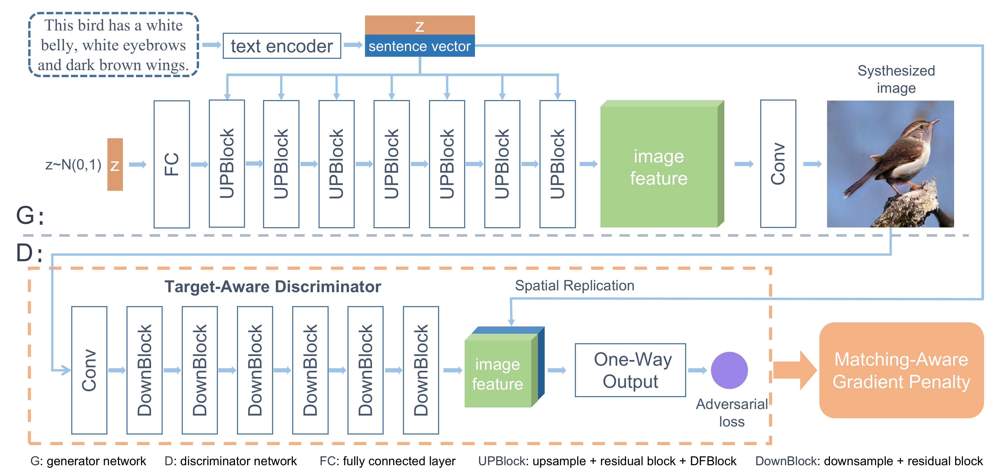

[](https://github.com/tobran/DF-GAN/blob/master/LICENSE.md)


[](<(https://github.com/tobran/DF-GAN/graphs/commit-activity)>)


### Computer Vision Course | Final Project

<!--Thử nghiệm và cải tiến mô hình DF-GAN trong bài toán text-to-image-->

# Testing and improving the DF-GAN model in the Text-to-Image problem

**20120502-Nguyễn Minh Kha**
**20120579-Vũ Văn Thái**

Our paper [DF-GAN: A Simple and Effective Baseline for Text-to-Image Synthesis](https://arxiv.org/abs/2008.05865) by [Ming Tao](https://scholar.google.com/citations?user=5GlOlNUAAAAJ), [Hao Tang](https://scholar.google.com/citations?user=9zJkeEMAAAAJ&hl=en), [Fei Wu](https://scholar.google.com/citations?user=tgeCjhEAAAAJ&hl=en), [Xiao-Yuan Jing](https://scholar.google.com/citations?hl=en&user=2IInQAgAAAAJ), [Bing-Kun Bao](https://scholar.google.com/citations?user=lDppvmoAAAAJ&hl=en), [Changsheng Xu](https://scholar.google.com/citations?user=hI9NRDkAAAAJ).
Original code: https://github.com/tobran/DF-GAN



## Setup

Clone this repo.

```
git clone https://github.com/tobran/DF-GAN
pip install -r requirements.txt
cd DF-GAN/code/
```

## Preparation

### Datasets

- We use dataset [birds](https://paperswithcode.com/dataset/cub-200-2011) to evaluation model.
- You can get preprocessed dataset [link here](https://studenthcmusedu-my.sharepoint.com/:f:/g/personal/20120579_student_hcmus_edu_vn/EoDPeoB_FMFKmTHyObFEDo4B9pUIOR7ba_MItIXgA9xuQQ?e=FxwaVi)
- After download, you unzip and put in folder data:
  data/birds/...

## Training

```
cd DF-GAN/code/
```

### Train the DF-GAN model

- For bird dataset: `bash scripts/train.sh ./cfg/bird.yml`

### Resume training process

If your training process is interrupted unexpectedly, set **resume_epoch** and **resume_model_path** in train.sh to resume training.

### TensorBoard

Our code supports automate FID evaluation during training, the results are stored in TensorBoard files under ./logs. You can change the test interval by changing **test_interval** in the YAML file.

- For bird dataset: `tensorboard --logdir=./code/logs/bird/train --port 8166`

## Evaluation

### Download Pretrained Model

- With limited hardware, we only train a small part of the model. If you want to test on the best model, you can try it here [DF-GAN for bird](https://drive.google.com/file/d/1rzfcCvGwU8vLCrn5reWxmrAMms6WQGA6/view?usp=sharing). Download and save it to `./code/saved_models/bird/`

### Evaluate DF-GAN models

We synthesize about 3w images from the test descriptions and evaluate the FID between **synthesized images** and **test images** of each dataset.

```
cd DF-GAN/code/
```

- For bird dataset: `bash scripts/calc_FID.sh ./cfg/bird.yml`
- We compute inception score for models trained on birds using [StackGAN-inception-model](https://github.com/hanzhanggit/StackGAN-inception-model).

**Reference**

- [StackGAN++: Realistic Image Synthesis with Stacked Generative Adversarial Networks](https://arxiv.org/abs/1710.10916) [[code]](https://github.com/hanzhanggit/StackGAN-v2)
- [AttnGAN: Fine-Grained Text to Image Generation with Attentional Generative Adversarial Networks](https://openaccess.thecvf.com/content_cvpr_2018/papers/Xu_AttnGAN_Fine-Grained_Text_CVPR_2018_paper.pdf) [[code]](https://github.com/taoxugit/AttnGAN)
- [DM-GAN: Realistic Image Synthesis with Stacked Generative Adversarial Networks](https://arxiv.org/abs/1904.01310) [[code]](https://github.com/MinfengZhu/DM-GAN)
