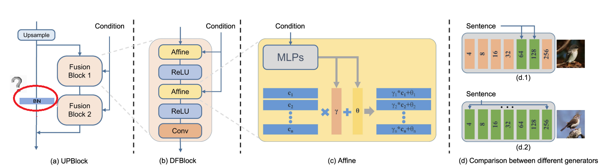

[](https://github.com/tobran/DF-GAN/blob/master/LICENSE.md)


[](<(https://github.com/tobran/DF-GAN/graphs/commit-activity)>)


### Computer Vision Course | Final Project

<!--Thử nghiệm và cải tiến mô hình DF-GAN trong bài toán text-to-image-->

# Testing and improving the DF-GAN model in the Text-to-Image problem

**20120502-Nguyễn Minh Kha**
**20120579-Vũ Văn Thái**

Our paper [DF-GAN: A Simple and Effective Baseline for Text-to-Image Synthesis](https://arxiv.org/abs/2008.05865) by [Ming Tao](https://scholar.google.com/citations?user=5GlOlNUAAAAJ), [Hao Tang](https://scholar.google.com/citations?user=9zJkeEMAAAAJ&hl=en), [Fei Wu](https://scholar.google.com/citations?user=tgeCjhEAAAAJ&hl=en), [Xiao-Yuan Jing](https://scholar.google.com/citations?hl=en&user=2IInQAgAAAAJ), [Bing-Kun Bao](https://scholar.google.com/citations?user=lDppvmoAAAAJ&hl=en), [Changsheng Xu](https://scholar.google.com/citations?user=hI9NRDkAAAAJ).
Original code: https://github.com/tobran/DF-GAN


## Setup

- Clone this repo or download zip

```
git clone https://github.com/vvthai10/cv_project.git
```

- Install libraries

```
pip install -r requirements.txt
```

- Next, open folder code

```
cd ./code
```

## Preparation

### Datasets

- We use dataset [birds](https://paperswithcode.com/dataset/cub-200-2011) to train and evaluation model.
- You can get preprocessed dataset [link here](https://studenthcmusedu-my.sharepoint.com/:f:/g/personal/20120579_student_hcmus_edu_vn/EoDPeoB_FMFKmTHyObFEDo4B9pUIOR7ba_MItIXgA9xuQQ?e=FxwaVi)
- After download, you unzip and put in folder data:

```
data
  | birds
      |...
```

## Training

```
cd DF-GAN/code/
bash scripts/train.sh ./cfg/bird.yml
```

- **Note:**
  - If the hardware is weak, you can adjust the variable value `batch_size_per_gpu` in train.sh
  - If your training process is interrupted unexpectedly, set **resume_epoch** and **resume_model_path** in train.sh to resume training.

### TensorBoard

Our code supports automate FID evaluation during training, the results are stored in TensorBoard files under ./logs. You can change the test interval by changing **test_interval** in the YAML file.

- For bird dataset: `tensorboard --logdir=./code/logs/bird/train --port 8166`

## Evaluation

We synthesize about 3w images from the test descriptions and evaluate the FID between **synthesized images** and **test images** of each dataset.

```
cd DF-GAN/code/
bash scripts/calc_FID.sh ./cfg/bird.yml
```

- We compute inception score for models trained on birds using [StackGAN-inception-model](https://github.com/hanzhanggit/StackGAN-inception-model).

### Performance

In the original model, epochs = 1301. We only train to epochs = 70. Below is the evaluation of the model results.

| Model                    | CUB-FID   |
| ------------------------ | --------- |
| DF-GAN(paper)            | 14.81     |
| DF-GAN(pretrained model) | 12.10     |
| DF-GAN(pretrained model) | **32.72** |

### Test models

Replace your text descriptions into the ./code/example_captions/dataset_name.txt

```
cd DF-GAN/code/
bash scripts/sample.sh ./cfg/bird.yml
```

### Model Improvement

Trong nội dung môn học, chúng tôi tìm kiếm các phương pháp khác nhau để có thể cải thiện độ chính xác của mô hình, chúng tôi phân tích mô hình thành từng bước để có thể đánh giá và áp dụng các phương pháp khác tốt hơn.

- Chúng tôi sử dụng các mô hình mới hơn dựa trên kiến trúc GAN để so sánh:
  - [Text to Image Generation with Semantic-Spatial Aware GAN](https://arxiv.org/pdf/2104.00567.pdf)
  - [Cross-Modal Contrastive Learning for Text-to-Image Generation](https://arxiv.org/pdf/2101.04702.pdf)
- Các phần chúng tôi đánh giá và đề xuất phương pháp:

  - **Processing text**: Từ bài báo AttnGAN, họ đề xuất một phương pháp xử lý text, thì các bài báo làm về chủ đề này sau này sử dụng lại ý tưởng này khá nhiều. Do đó chúng tôi không đề suất thêm phương pháp nào trong phần này cả
  - **Generator**: Phần được các nghiên cứu tập trung tìm các cách tiếp cận khác nhau, chúng tôi tập trung tìm hiểu phần này và đề xuất các cách cải thiện cho mô hình chúng tôi đang triển khai.

    - SSA-GAN: Mô hình này có kiến trúc khá giống với DF-GAN, thay vì sử dụng khối UPBlock, họ sử dụng khối **SSACN**, kiến trúc khối này có áp dụng layer `Semantic-Spatial Condition Batch Normalization`. Đây là một layer được trình bày trong một nghiên cứu trước đó [SD-GAN](https://arxiv.org/pdf/1904.01480.pdf). Đây giống như 1 phương pháp BN-chuẩn hóa dữ liệu, nhưng nó sẽ chuẩn hóa theo từng chiều, điều này cho phép sử lý thông tin 1 cách riêng biệt hơn. Chúng tôi nghĩ việc này nếu áp dụng trong UPBlock có thể cải thiện(**việc loại bỏ BN cũng được nhắc đến trong bài báo gốc của mô hình**)
      

    - XMC-GAN: Sự khác biệt đầu tiên là việc xử lý text đầu vào là dùng mô hình [BERT](https://arxiv.org/abs/1810.04805), Trong phần **G**, mô hình sử dụng khối **ResBlockUp**. Theo đánh giá của chúng tôi, mô hình sử dụng đầu vào cho layer tiếp theo là 2 lần dữ liệu về text(**một là `word embeddings` và `sentence embeddings`**). Và trong khối **ResBlockUp** họ cũng sử dụng layer BN.
  
Để có thể áp dụng các phần này vào việc cải tiến mô hình, chúng tôi đề xuất cách:
    - Sử dụng **BERT** cho việc xử lý và áp dụng text
    - Đồng thời áp dụng cả **BN** như đề xuất cải tiến 1.

  - **Discriminator**: Phần phân biệt ảnh thật giả trong các mô hình không có đề cập quá nhiều, chúng tôi nghiên cứu các bài báo gần đây thì đa phần họ đều không chỉnh sửa quá nhiều phần này. Do vậy chúng tôi cũng không đi sâu để tìm phương pháp cải thiện cho phần này.

### Download Pretrained Model

- With limited hardware, we only train a small part of the model. If you want to test on the best model, you can try it here [DF-GAN for bird](https://drive.google.com/file/d/1rzfcCvGwU8vLCrn5reWxmrAMms6WQGA6/view?usp=sharing). Download and save it to `./code/saved_models/bird/`

**Reference**

- [StackGAN++: Realistic Image Synthesis with Stacked Generative Adversarial Networks](https://arxiv.org/abs/1710.10916) [[code]](https://github.com/hanzhanggit/StackGAN-v2)
- [AttnGAN: Fine-Grained Text to Image Generation with Attentional Generative Adversarial Networks](https://openaccess.thecvf.com/content_cvpr_2018/papers/Xu_AttnGAN_Fine-Grained_Text_CVPR_2018_paper.pdf) [[code]](https://github.com/taoxugit/AttnGAN)
- [DM-GAN: Realistic Image Synthesis with Stacked Generative Adversarial Networks](https://arxiv.org/abs/1904.01310) [[code]](https://github.com/MinfengZhu/DM-GAN)
